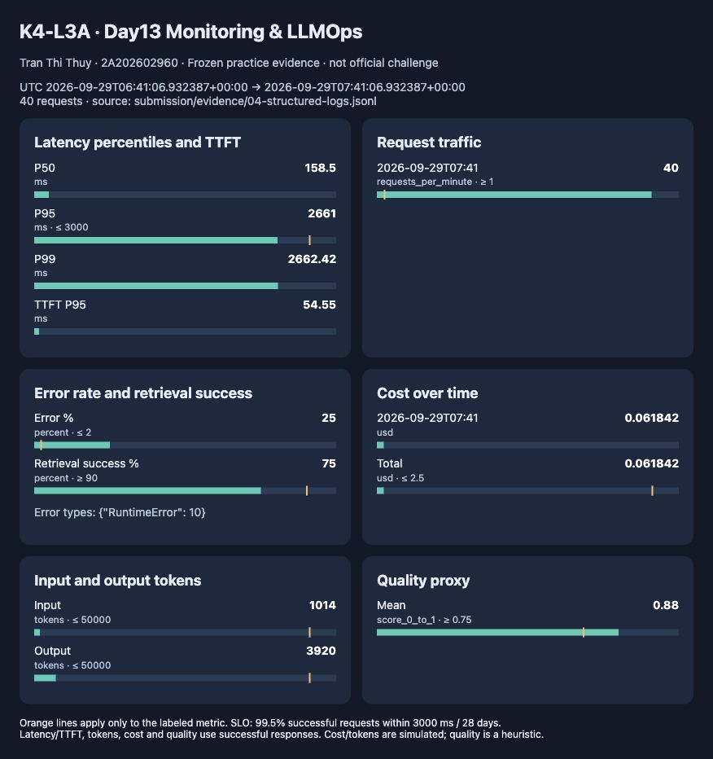
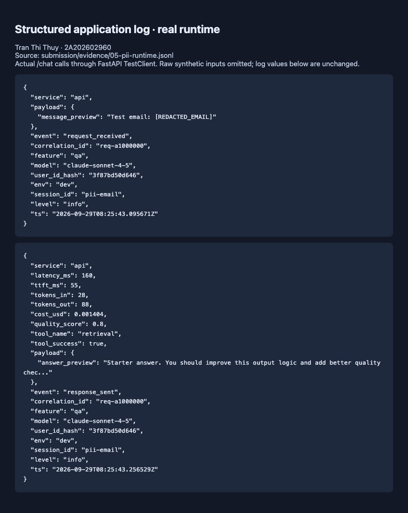
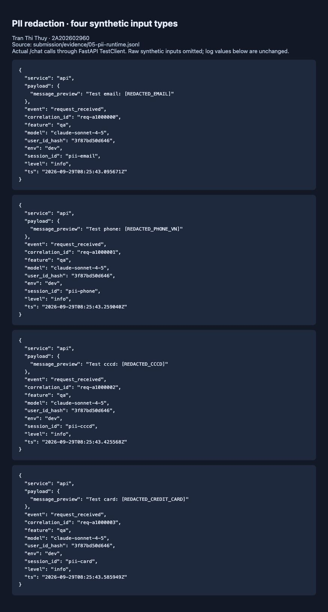

# Báo cáo kỹ thuật — Day 13 Monitoring & LLMOps

> Báo cáo cá nhân được hỗ trợ bởi AI, dựa trên source và kết quả chạy thực tế.
> Đã hoàn thiện phần không phụ thuộc challenge; CP3 chờ file chính thức của giảng viên.
> Phần tự đánh giá là bản tổng hợp để học viên rà lại và sử dụng khi giải thích bài.

## 1. Thông tin

- Họ tên: Trần Thị Thủy.
- MSSV: 2A202602960; lớp theo đề: K4-L3A.
- Repository: https://github.com/thuyannie2310/K4-L3-DAY13-TranThiThuy-2A202602960-Monitoring-LLMOps
- Commit nộp: dùng SHA của commit chứa báo cáo này trên GitHub (lấy bằng `git rev-parse HEAD`); link bài nộp trỏ tới chính commit. Đây là bản trước challenge, sẽ cập nhật khi có file giảng viên.
- Project đã kết nối: [day13-k4-l3a-2A202602960](https://cloud.langfuse.com/project/cmumdz0uk01raad0dbetvfxew/traces).
- Challenge ID: chưa có file giảng viên; không tự tạo challenge.

## 2. Evidence thực tế

| Nội dung | Evidence |
|---|---|
| Baseline tests | [22 passed](evidence/00-baseline-tests.txt) |
| Baseline log validator | [Chưa có runtime log](evidence/00-baseline-logs.txt) |
| Baseline dashboard contract | [6/6](evidence/00-baseline-dashboard.txt) |
| Tests hiện tại | [29 passed](evidence/01-pytest.txt) |
| Log validator | [100/100; 0 PII leak](evidence/02-log-validator.txt) |
| Dashboard validator | [6/6](evidence/03-dashboard-validator.txt) |
| Structured logs đã scrub | [84 dòng JSONL](evidence/04-structured-logs.jsonl) |
| Dashboard có dữ liệu | [HTML mở bằng trình duyệt](evidence/11-dashboard.html), [số liệu JSON](evidence/11-dashboard.json) |
| Workload và responses | [local-runtime.json](evidence/local-runtime.json) |

Đã có ảnh [trace list](evidence/15-trace-list.png), [waterfall/metadata](evidence/16-trace-timeline.png),
[promote v2](evidence/13-production-v2.png), [rollback v1](evidence/14-rollback-v1.png).
Đã bổ sung [dashboard PNG](evidence/11-dashboard-overview.png),
[structured log](evidence/04-structured-log.png) và [PII runtime](evidence/05-pii-redaction.png).
Chỉ evidence incident challenge chính thức còn chờ file giảng viên.

## 3. Kết quả chạy local

Workload gọi ASGI app thật bằng HTTPX ASGITransport, gồm 4 lượt × 10 câu hỏi mẫu.
Không đi qua TCP/uvicorn; tests không chứng minh network deployment.

| Scenario practice | Requests | HTTP 500 | Latency P95 (ms, response thành công) |
|---|---:|---:|---:|
| baseline | 10 | 0 | 156.55 |
| rag_slow | 10 | 0 | 2662.1 |
| tool_fail | 10 | 10 | None |
| recovery | 10 | 0 | 161.1 |

Trong toàn cửa sổ dashboard: latency P95 **2661.0 ms**,
TTFT P95 **54.55 ms**, error **25%**, retrieval
success **75%**. Tỷ lệ lỗi cao do cố ý bật tool_fail, không bị xóa khỏi evidence.
Cost tổng **0.061842 USD** là ước tính giả lập, không phải hóa đơn.
Quality trung bình **0.88** là heuristic, không chứng minh độ đúng.
Không có baseline runtime trước sửa; không bịa số liệu so sánh trước/sau.

### Bảng thông số đầy đủ của cửa sổ practice

Nguồn cố định: [84 dòng log](evidence/04-structured-logs.jsonl) và [số liệu dashboard](evidence/11-dashboard.json).
Cửa sổ UTC: **06:41:06.932387–07:41:06.932387 ngày 29/09/2026** (13:41–14:41 giờ Việt Nam).
Các lần kiểm tra PII và Langfuse diễn ra sau đó được lưu riêng, không gộp vào bảng này.

| Nhóm | Chỉ số đo được | Diễn giải / ngưỡng |
|---|---|---|
| Latency | P50 **158.5 ms**; P95 **2661 ms**; P99 **2662.42 ms** | Chỉ response thành công; P95 ≤ 3000 ms |
| TTFT | P95 **54.55 ms** | Thời gian đến token đầu tiên giả lập; chưa đặt SLO riêng |
| Traffic | **40 request**; bucket 07:41 UTC có **40 request/phút** | Ngưỡng tham chiếu ≥ 1 request/phút; không suy ra tải bền vững từ một burst |
| Errors | **10/40 = 25%**; **10 RuntimeError** | Vượt guardrail 2% vì chủ động bật tool_fail |
| Retrieval | **30/40 = 75%** thành công | Thấp hơn guardrail ≥ 90% |
| Cost | **0.061842 USD** trong bucket 07:41 và toàn cửa sổ | Ước tính giả lập; line 2.5 USD là tham chiếu cửa sổ, không xác minh ngân sách cả ngày |
| Tokens | Input **1014**; output **3920**; tổng **4934** | Tổng 30 response thành công; mỗi nhóm ≤ 50000 |
| Quality | Mean **0.88/1** | Heuristic trên 30 response; ngưỡng ≥ 0.75, không phải độ chính xác 88% |




## 4. Logging và PII

Middleware xóa context đầu/cuối request; nhận header hợp lệ `req-<8-hex>` hoặc
sinh UUID rút gọn; trả `x-request-id`, `x-response-time-ms`. ID sai định dạng được
thay mới để tránh đưa dữ liệu tùy ý vào metadata. Log bind user hash SHA-256,
session, feature, model, env trước request_received.

Scrubber đệ quy xử lý chuỗi trong dict/list, kể cả exception sau format và trước
file writer/JSON renderer. Có rule email, điện thoại Việt Nam, CCCD, thẻ 16 số.
Test bổ sung kiểm tra metadata tách biệt giữa request đồng thời, header và PII lồng nhau.
Regex chỉ bảo vệ các dạng đã định nghĩa; không phải bộ phát hiện mọi loại PII.

Kiểm tra runtime bổ sung gửi bốn request `/chat` bằng FastAPI TestClient, dùng dữ liệu giả sinh trong bộ nhớ.
Cả bốn trả HTTP 200, response header giữ đúng ID truyền vào:

| Loại | Correlation ID | Marker trong log |
|---|---|---|
| Email | `req-a1000000` | `[REDACTED_EMAIL]` |
| Điện thoại | `req-a1000001` | `[REDACTED_PHONE_VN]` |
| CCCD | `req-a1000002` | `[REDACTED_CCCD]` |
| Thẻ | `req-a1000003` | `[REDACTED_CREDIT_CARD]` |

[Log JSONL runtime](evidence/05-pii-runtime.jsonl), [kết quả kiểm tra/header](evidence/05-pii-checks.json).
Ảnh bên dưới hiển thị nguyên giá trị JSON từ file log, chỉ đổi cách xuống dòng cho dễ đọc;
không phải ảnh trace Langfuse. Lượt kiểm tra này chạy local, tắt tracing, không tạo cloud trace mới.





## 5. Tracing và prompt

Cấu trúc mã: `lab-agent-run` → `retrieval` và `llm-generation`.
Decorator tắt capture input/output tự động. Generation chỉ gửi preview đã scrub,
model, usage input/output, cost, prompt managed và version thực lấy từ Langfuse.
Metadata correlation_id nối log với trace; user ID chỉ gửi hash.

Đã cấu hình `.env` riêng tại máy, Git ignore và quyền file 0600; SDK auth_check thành công.
Ngày 2026-09-29, `/health` qua TCP uvicorn trả `ok=true`, `tracing_enabled=true`.
10 request mẫu qua HTTP đều trả 200. Cloud xác minh **14 traces / 42 observations**:
10 baseline HTTP và 4 lượt kiểm tra prompt bằng FastAPI TestClient (ASGI, tiến trình mới mỗi lượt để tránh cache).
Mỗi trace có agent, retrieval và generation; generation liên kết managed prompt đúng phiên bản.

| Bước | Label | Version | Trace ID | Correlation ID |
|---|---|---:|---|---|
| baseline | baseline | 1 | `1b8124121ed748b4a1f4ed4d54f11564` | `req-9c149815` |
| candidate | candidate | 2 | `6ff602cd9e7e26b159fb00862f64034c` | `req-ed52ce3d` |
| promoted | production | 2 | `14ed0c6ac9676352e7333c94b14098ab` | `req-e4026b00` |
| rollback | production | 1 | `7e9e3367c158ab7ff78fe1616a4c838a` | `req-7cef16d1` |

Cùng input: `Explain how metrics, logs and traces help debug latency.`
V1 giữ ba biến feature/docs/message; v2 thêm yêu cầu tối đa ba câu.
Đã promote production → v2 và rollback production → v1, xác minh bằng request thực sau mỗi bước.
Trạng thái cuối: v1 có baseline/production; v2 có candidate/latest.
LLM vẫn là FakeLLM; đây là bằng chứng quản lý phiên bản, không phải đánh giá chất lượng mô hình thật.

Evidence: [responses và trace IDs](evidence/12-prompt-runs.json),
[observations đọc lại từ Cloud](evidence/12-cloud-observations.json),
[ảnh promote](evidence/13-production-v2.png), [ảnh rollback](evidence/14-rollback-v1.png).
Export JSON đã bỏ metadata SDK chứa public key. API đọc legacy trả 410 cho organization mới;
đã dùng Observations API v2 với khoảng thời gian giới hạn để xác minh.

## 6. Dashboard, SLO, alerts

[Dashboard contract](../config/dashboard.yaml) có sáu panel. Script
[build_dashboard.py](../scripts/build_dashboard.py) tổng hợp data/logs.jsonl
trong 60 phút UTC, vẽ giá trị và marker threshold. Chế độ `--serve` đọc lại logs
và refresh trang mỗi 30 giây; chỉ phục vụ dashboard và JSON tổng hợp tại localhost.
Bản evidence dùng `--end` cố định để tái hiện đúng cửa sổ đã đo. Panel errors dùng
cả response_sent và request_failed để retrieval success có mẫu số đúng.
Ngưỡng retrieval ≥ 90% tách khỏi ngưỡng error ≤ 2%; không gán ngưỡng P95 cho TTFT.
Percentile dùng nội suy tuyến tính. Khi không có dữ liệu, tỷ lệ/percentile/quality là N/A.

Tái hiện ảnh từ log đã lưu:

```bash
python scripts/build_dashboard.py --logs submission/evidence/04-structured-logs.jsonl --end 2026-09-29T07:41:06.932387+00:00
```

Dashboard live khi API đang tạo logs:

```bash
python scripts/build_dashboard.py --serve
# mở http://127.0.0.1:8765
```


[SLO](../config/slo.yaml): trong 28 ngày, 99.5% request thành công ≤ 3000 ms.
Budget = 0.5% × tổng request; 100000 request cho phép 500 request lỗi/chậm.
Baseline practice khoảng 0.16 giây và rag_slow khoảng 2.66 giây, nên rag_slow
làm latency tăng nhưng chưa vượt ngưỡng 3 giây. Không kết luận alert đã firing.
Cần đo tải và kỳ vọng người dùng thực trước khi áp dụng SLO production.

**Công thức:** SLI = số response thành công có latency ≤ 3000 ms / số request nhận vào.
Error budget = (1 − 0.995) × N = 0.005 × N. Request vừa lỗi vừa chậm chỉ được tính một lần.
Với workload practice đã hoàn tất: 30 good / 40 total = **75%**, 10 bad;
ngân sách minh họa 0.2 request, tiêu thụ 10/0.2 = **50 lần** (5000%).
Đây là phép minh họa trên sample cố ý có lỗi, **không phải kết luận SLO rolling 28 ngày**.
Để đánh giá production cần đủ dữ liệu của cửa sổ 28 ngày và tránh cắt request đang xử lý ở biên cửa sổ.

[Ba alert](../config/alert_rules.yaml): P95 cao, error rate cao, quality thấp;
đều có duration, minimum traffic, severity, owner, kênh Slack dự kiến và
[runbook](../docs/alerts.md). Chưa triển khai alert engine hoặc gửi Slack thật.

| Alert | Điều kiện | Duy trì | Mức độ | Owner / kênh | Hành động đầu tiên |
|---|---|---|---|---|---|
| high_tail_latency | P95 5 phút > 3000 ms; ≥ 20 requests | 5 phút | warning | TranThiThuy / #llmops-alerts | Tìm correlation ID chậm và span chiếm thời gian |
| high_request_error_rate | Error 5 phút > 2%; ≥ 20 requests | 5 phút | critical | TranThiThuy / #llmops-alerts | Nhóm error_type, đối chiếu retrieval và dependency |
| low_answer_quality | Mean quality 15 phút < 0.75; ≥ 20 responses | 15 phút | warning | TranThiThuy / #llmops-alerts | Kiểm tra retrieval và version prompt trước/sau |

Burst practice ngắn không chứng minh điều kiện tồn tại liên tục đủ 5/15 phút.
Có ngưỡng bị vượt trên snapshot không đồng nghĩa hệ thống đã phát cảnh báo.

## 7. Điều tra practice; challenge còn chờ

Khoảng dữ liệu UTC: 2026-09-29T06:41:06.932387+00:00 → 2026-09-29T07:41:06.932387+00:00.
Triệu chứng: P95 tăng trong rag_slow, HTTP 500 trong tool_fail.
Ví dụ request chậm: `req-c046fd5c`, latency **2657 ms**;
đối chiếu log JSONL. Mã mock_rag có sleep 2.5 giây khi bật rag_slow;
tool_fail ném RuntimeError. Đây là giải thích từ kịch bản/source, **chưa phải
root cause được xác nhận bằng cloud trace**.

Mitigation đã thực hiện: tắt từng scenario, chạy recovery 10 request thành công.
Phòng ngừa thực tế: timeout retrieval, fallback, circuit breaker, load test;
đây là đề xuất, chưa triển khai trong bài. Challenge chính thức và chuỗi
metric → log → trace của challenge cần bổ sung sau khi nhận file.

### CP3 đang chờ phát hành

Challenge ID **kỳ vọng theo đề**: `day13-k4-l3a-monitoring-llmops-v1`; chưa xác minh từ file.
Chưa có metric/time range, correlation ID, trace ID hay root cause chính thức.
Khi giảng viên mở challenge: đặt nguyên file tại `config/challenge.json`, xác minh đúng lớp/ID,
chạy inject và workload theo hướng dẫn, sau đó bổ sung ba evidence cùng sự cố.
Không dùng số liệu practice thay cho kết quả challenge và không tự tạo/sửa file.

## 8. Mục tiêu, ứng dụng và nội dung cần hiểu

Mục tiêu là biến API AI từ hộp đen thành hệ thống quan sát được:
- Metrics trả lời “có gì bất thường và lúc nào?”.
- Logs trả lời “request nào bị ảnh hưởng?” thông qua correlation_id.
- Traces trả lời “bước tìm tài liệu hay gọi LLM gây chậm/lỗi?”.

Ví dụ chatbot chăm sóc khách hàng trả lời chậm: P95 báo vấn đề; log tìm request;
trace cho biết truy vấn tài liệu chậm. Có thể xử lý đúng dependency thay vì đổi
mô hình theo phỏng đoán. Token/cost giúp phát hiện câu trả lời quá dài; prompt
version cho phép xác định thay đổi và rollback; PII scrub giảm lộ thông tin;
SLO giúp quyết định khi nào cần xử lý sự cố.

Quyết định kỹ thuật: chuyển endpoint /chat đồng bộ sang thread pool của FastAPI,
tránh time.sleep của fake LLM/retrieval chặn event loop. Giữ dashboard lấy logs
làm nguồn chuẩn vì /metrics của starter giữ dữ liệu trong bộ nhớ và đếm traffic
thành công, không đại diện đầy đủ requests có lỗi.

Blocker: Python mặc định 3.14 không phù hợp dependency ghim; đã dùng Python 3.13.
Blocker thứ hai: API đọc trace cũ trả 410 với organization Langfuse mới.
Cách xử lý là dùng Observations API v2 có from/to thời gian, nhóm observations theo traceId;
đối chiếu đủ ba span và promptVersion thay vì coi việc export thành công là bằng chứng đã lưu cloud.
Langfuse đã hoàn thành; challenge chính thức còn thiếu.

## 9. Tự đánh giá và bài học

### Kết quả đạt được

Tôi đánh giá phần logging, PII, tracing, prompt management và dashboard đã có bằng chứng chạy thực tế.
Tôi phân biệt được technical gate với kết quả vận hành: 100/100 log validator chỉ xác nhận
các tiêu chí mà validator kiểm tra, không phải điểm toàn bài; 6/6 dashboard contract vẫn cần
ảnh runtime có số liệu. Tương tự, tests pass không thay thế việc đọc lại trace trên Langfuse.

Qua workload practice, tôi rút ra rằng average hoặc P50 dễ che khuất request chậm:
P50 chỉ 158.5 ms nhưng P95 lên 2661 ms do retrieval bị làm chậm có chủ đích.
Khi điều tra, tôi bắt đầu từ metric và time range, chọn log có correlation ID, rồi tìm đúng trace
để xác định span. Tôi không kết luận root cause chỉ dựa trên một biểu đồ hay một exception riêng lẻ.

Prompt name/version/label giúp truy xuất cấu hình thực dùng trong mỗi request.
Tôi đã kiểm chứng baseline v1, candidate v2, production v2 rồi rollback về v1 bằng trace IDs.
Rollback có giá trị vận hành vì có thể quay lại phiên bản đã biết mà không phải sửa source;
cần xử lý cache để request sau đổi label không tiếp tục dùng phiên bản cũ.

Token và cost cho thấy mức sử dụng tài nguyên, còn SLO/error budget giúp ưu tiên độ ổn định.
Tôi không coi token/cost giả lập là hóa đơn thật, cũng không coi quality proxy 0.88 là độ chính xác 88%.
PII cần được scrub trước khi ghi file và trước khi đưa input/output vào trace;
che trên ảnh sau khi dữ liệu đã gửi đi không thay thế bảo vệ tại nguồn.

### Hạn chế còn lại và hướng cải thiện

- Chưa có challenge chính thức nên chưa tự đánh giá hoàn thành CP3 hoặc điểm incident.
- FakeLLM và heuristic quality chỉ phục vụ quan sát; muốn đánh giá sản phẩm cần dataset chuẩn và đánh giá đầu ra độc lập.
- Regex PII chỉ bao phủ mẫu đã định nghĩa, có thể bỏ sót biến thể hoặc che nhầm chuỗi số/hash 12 chữ số; cần cơ chế theo loại field và kiểm thử rộng hơn trước khi dùng production.
- Latency/TTFT dashboard hiện tổng hợp response thành công; error panel giữ số request lỗi. Muốn đo latency toàn bộ requests cần bổ sung thời gian ở nhánh lỗi.
- Alert YAML/runbook đã đủ cấu hình nhưng chưa có alert engine, không có bằng chứng Slack notification thật.
- File JSONL và dashboard local phù hợp lab; hệ thống thật cần lưu trữ tập trung, retention, phân quyền, kiểm soát sampling và tải đồng thời.
- SLO 28 ngày là mục tiêu được định nghĩa; workload ngắn chưa đủ để chứng minh tuân thủ dài hạn.

### Đối chiếu rubric trước challenge

| Hạng mục | Trạng thái tự đánh giá | Căn cứ |
|---|---|---|
| A. Logging/correlation | Đã triển khai và kiểm tra | Header, JSONL, tests, validator |
| B. PII | Đạt bốn nhóm mẫu đã kiểm tra | Runtime marker và tests; còn giới hạn regex |
| C. Tracing/prompt | Đã hoàn thành | 14 traces/42 observations, v1/v2, promote/rollback |
| D. Dashboard/SLO/alerts | Có sáu panel, SLO/budget, ba alert/runbook | PNG, JSON, YAML; chưa chạy alert engine |
| E. Incident chính thức | Chưa thực hiện | Chờ challenge giảng viên |
| F. Tái hiện/tích hợp | Tests hiện tại đạt; chờ commit cuối | 29 tests, lệnh chạy, secret scan |
| G. Báo cáo/hiểu bài | Đã có phân tích và evidence phần hiện tại | Các mục 1–9; Q&A do học viên trình bày |

Không tự nhận điểm chấm chính thức hoặc cộng bonus khi chưa hoàn thành challenge end-to-end.

## 10. Evidence và việc còn lại

| Evidence | File |
|---|---|
| Test cuối working tree | [01-pytest.txt](evidence/01-pytest.txt) |
| Log validator | [02-log-validator.txt](evidence/02-log-validator.txt) |
| Dashboard validator | [03-dashboard-validator.txt](evidence/03-dashboard-validator.txt) |
| Structured log | [04-structured-log.png](evidence/04-structured-log.png) |
| PII redaction | [05-pii-redaction.png](evidence/05-pii-redaction.png), [JSONL](evidence/05-pii-runtime.jsonl) |
| Trace list | [15-trace-list.png](evidence/15-trace-list.png) |
| Waterfall/metadata | [16-trace-timeline.png](evidence/16-trace-timeline.png), [cloud JSON](evidence/12-cloud-observations.json) |
| Prompt versions/promote | [13-production-v2.png](evidence/13-production-v2.png) |
| Rollback | [14-rollback-v1.png](evidence/14-rollback-v1.png), [run IDs](evidence/12-prompt-runs.json) |
| Dashboard runtime | [11-dashboard-overview.png](evidence/11-dashboard-overview.png), [HTML](evidence/11-dashboard.html), [JSON](evidence/11-dashboard.json) |
| Secret/evidence audit | [18-evidence-audit.txt](evidence/18-evidence-audit.txt) |
| Incident metric/log/trace | Chờ challenge chính thức |

- [x] Tests, log validator và dashboard contract đạt trên working tree.
- [x] Có practice runtime, structured logs, PII và dashboard PNG.
- [x] Có ≥10 cloud traces, waterfall/metadata và managed prompt v1/v2, promote/rollback.
- [x] Hoàn thiện bảng thông số, SLO/error budget, alerts, blocker và tự đánh giá.
- [ ] Nhận file giảng viên, chạy challenge đúng lớp, bổ sung metric → log → trace.
- [ ] Bản trước challenge: commit/push và nộp permalink SHA; trạng thái gửi LMS kiểm tra trực tiếp trên VLearn.
- [ ] Sau challenge: bổ sung evidence rồi cập nhật commit và bài nộp mới.

## 11. Danh sách trace đã xác minh

Dữ liệu đọc lại từ project cá nhân; source: `12-cloud-observations.json`.

| Trace ID | Correlation ID | Prompt label/version | Generation input/output tokens | Cost USD (giả lập) |
|---|---|---|---|---|
| `91e84f145735e4c326e29df328ce41d5` | `req-e095612e` | production / 1 | 36 / 98 | 0.001578 |
| `45ae78066c492d191333a9be868fe868` | `req-16ac41de` | production / 1 | 32 / 176 | 0.002736 |
| `40f5dc4b7c4941833600d2f568a3f21c` | `req-b18a8594` | production / 1 | 43 / 135 | 0.002154 |
| `25e164119575c5c33a92bfac85fa59ad` | `req-451b0ddf` | production / 1 | 39 / 161 | 0.002532 |
| `b44a18dc9dbc0715d7c63bf0a1e6e524` | `req-14ea3a66` | production / 1 | 33 / 165 | 0.002574 |
| `f6d1cf5fc58ea95b1957ef413f02dd6f` | `req-01eab37d` | production / 1 | 35 / 180 | 0.002805 |
| `37f7bded9cb2c72ca23801dd544f0632` | `req-d562660a` | production / 1 | 29 / 177 | 0.002742 |
| `c3c457e7a2c8093f1144244dfd9449bd` | `req-1c37dbca` | production / 1 | 27 / 113 | 0.001776 |
| `037c5ed2726efc5b39b72ef197a688a4` | `req-93a3ea68` | production / 1 | 36 / 174 | 0.002718 |
| `82fe781632cf837d0e513e2ecc2a1325` | `req-a829eac4` | production / 1 | 28 / 95 | 0.001509 |
| `1b8124121ed748b4a1f4ed4d54f11564` | `req-9c149815` | baseline / 1 | 34 / 158 | 0.002472 |
| `6ff602cd9e7e26b159fb00862f64034c` | `req-ed52ce3d` | candidate / 2 | 45 / 149 | 0.00237 |
| `14ed0c6ac9676352e7333c94b14098ab` | `req-e4026b00` | production / 2 | 45 / 144 | 0.002295 |
| `7e9e3367c158ab7ff78fe1616a4c838a` | `req-7cef16d1` | production / 1 | 34 / 98 | 0.001572 |
